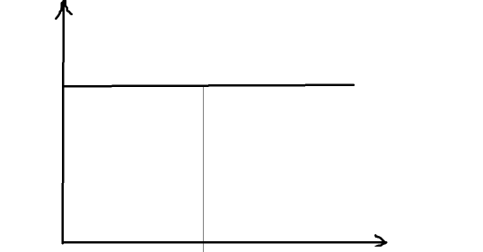
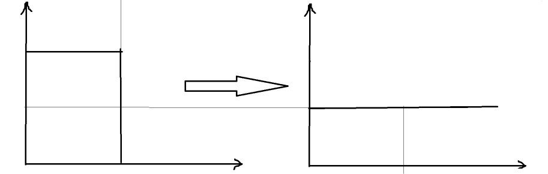
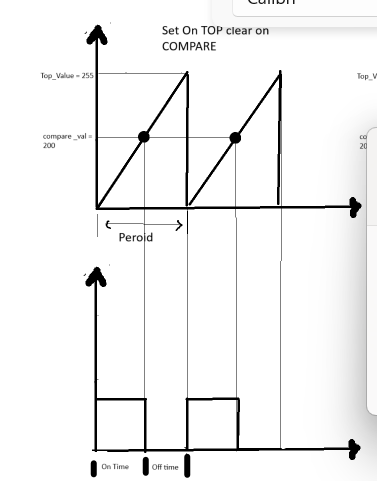
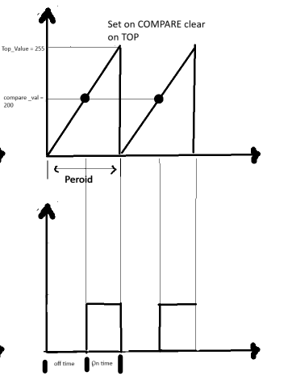
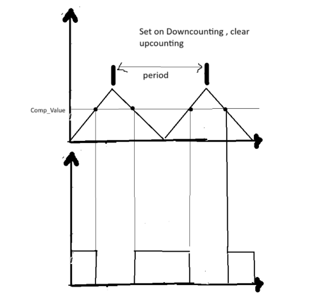
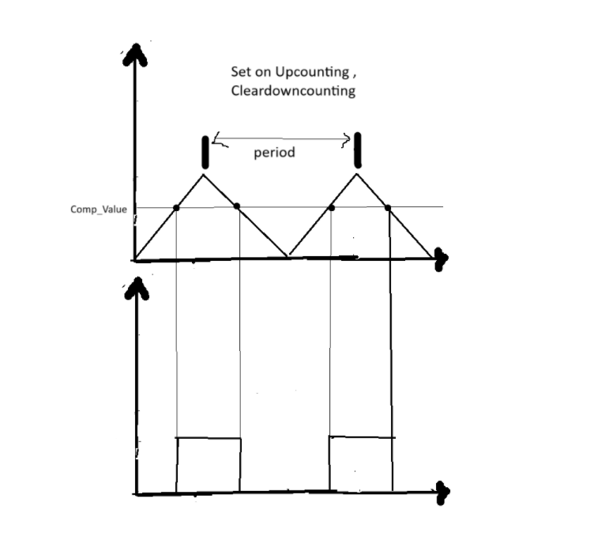

# **PWM Mode (Pulse Width Modulation)**

* PWM is a method to control the power delivered to electronic devices by switching a digital signal ON and OFF rapidly.

      

    

### **Characteristics:**

* **Amplitude** : The voltage level of the signal (e.g., 3.3V or 5V).
* **Period (T)** : Total time for one full ON + OFF cycle.

    T = 1 / Frequency
* **Frequency (f)** : Number of cycles per second (Hz).

    f = 1 / T
* **On-time (Ton)** : Duration of the HIGH (ON) signal.
* **Off-time (Toff)** : Duration of the LOW (OFF) signal.

    Toff = T - Ton
* **Duty Cycle (D)** : Percentage of time the signal is ON in one period.

    D = (Ton / T) × 100%

### **Example Duty Cycles:**

* 0% → Always OFF
* 25% → ON for 25%, OFF for 75%
* 50% → ON and OFF are equal
* 75% → ON for 75%, OFF for 25%
* 100% → Always ON

---

### **Why do we use PWM (Pulse Width Modulation)?**

1. **Load Control (Power Control)**
   * **PWM controls the average power** delivered to a load without wasting energy.
   * It’s used to:
     * Control **LED brightness**
     * Adjust **motor speed**
     * Manage **heater power**
     * Drive **buzzers/speakers**
   * Efficient because power is switched ON/OFF (not dissipated as heat like analog control).
2. **A Way of Communication (Signal Modulation)**
   * **PWM is used to encode information** in the width of the pulses.
   * Used in:
     * **Servo motors** : Position is controlled by PWM pulse width (e.g., 1–2 ms in a 20 ms frame).
     * **DC-DC Converters** : PWM regulates output voltage by controlling switching elements.
     * **IR remote controls** : Encode binary data using PWM-like pulses.


---

### How to generate PWM?

#### Software Methods

**1. Using DIO + Delay (Software PWM)**

* Toggle the pin HIGH and LOW manually .
* Use `delay_us()` or `delay_ms()` to control **on-time** and  **off-time** .
* ```c
  while (1) {
    DIO_HIGH;
    delay_us(on_time);
    DIO_LOW;
    delay_us(off_time);
  }
  ```

❌ CPU blocking, not accurate


**2. Using Timer in CTC Mode (Clear Timer on Compare Match)**

* Set a compare value (OCRn) to create a fixed period.
* Toggle pin using  **interrupt or toggle mode** .
* Change the ON time by adjusting OCRn dynamically.

  ```c
  TCCR0 |= (1 << WGM01); // CTC mode
  TCCR0 |= (1 << COM0A0); // Toggle OC0A on match
  OCR0A = value; // Control frequency/duty

  ```

  More accurate But only 50% duty cycle , to control duty cycle we need more control


```c
#define DUTY_TICKS 75  // 30% of 250 (for 1ms period)
#define PERIOD_TICKS 250

volatile uint8_t counter = 0;

void PWM_CTC_init() {
    DDRB |= (1 << PB0);               // PB0 = Output (PWM pin)

    TCCR0 |= (1 << WGM01);            // CTC mode
    TCCR0 |= (1 << CS01) | (1 << CS00); // Prescaler = 64
    OCR0 = 1;                         // Interrupt every 2 ticks (fine control)

    TIMSK |= (1 << OCIE0);            // Enable CTC interrupt
    sei();                            // Enable global interrupts
}

ISR(TIMER0_COMP_vect) {
    counter++;

    if (counter == 1) {
        PORTB |= (1 << PB0); // Start of cycle: turn ON
    }

    if (counter == DUTY_TICKS) {
        PORTB &= ~(1 << PB0); // After ON time: turn OFF
    }

    if (counter >= PERIOD_TICKS) {
        counter = 0; // Reset after full PWM period
    }
}

```


3. **Using Timer in Normal Mode (Same As Clear Timer on Compare Match)**

#### **Hardware Methods**

1. PWM Timers
2. PWM mode in normal timers

---


## What is Fast PWM Mode?

#### **1 - Set on TOP, Clear on Compare Match (Direct or Not Inverted)**

Fast PWM is a timer mode where:

* The timer counts **from 0 up to a TOP value** (e.g., 255 or OCRx).
* At each tick (timer increase), the timer compares its value with `OCRx`.
* Based on the compare result, it controls the output pin (OCx):
  * At  **Compare Match** : the pin is **cleared** (set LOW)
  * At  **TOP** : the pin is **set** (set HIGH again)

This results in a pulse with variable ON time = PWM.

It's the one used in arduino ide (analogWrite(value))

    


#### **2 - Clear on TOP, Set on Compare Match ( Inverted )**

This configuration gives you an **inverted PWM signal** — where the  **pin is LOW during the ON time** , and  **HIGH during the OFF time** .

This is called  **inverting PWM mode** , because the pulse logic is flipped:

* Duty cycle is still controlled by `OCRx`
* But the pulse is  **LOW for the ON time** , **HIGH for the OFF time**

    


---


## **What is Phase Correct PWM Mode?**

**Phase Correct PWM** is a timer mode where the counter **counts up** to a maximum value (TOP), then **counts down** back to zero.

This creates a  **symmetric PWM waveform** , with no phase shift — that's why it’s called **“phase correct.”**

#### **How it works (in AVR 8-bit Timer0)**

* Timer counts: `0 → 1 → 2 → ... → 255 → 254 → ... → 0`
* **Compare Match** occurs twice:
  * Once while **counting up**
  * Once while **counting down**

#### **1- Direct (Non-Inverting Mode) ,  (Set on Downcounting , Clear on upcounting)**

| Counting Direction      | Action on Match |           |
| ----------------------- | --------------- | --------- |
| **Up-counting**   | **Clear** | Goes LOW  |
| **Down-counting** | **Set**   | Goes HIGH |

    


#### **2- Inverted Mode Behavior in Phase Correct PWM:**

| **Counting Direction** | **Compare Match Action** |                |
| ---------------------------- | ------------------------------ | -------------- |
| Up-counting                  | **Set**(goes HIGH)       | ON (inverted)  |
| Down-counting                | **Clear**(goes LOW)      | OFF (inverted) |

🔁 The **pulse is HIGH during off-time** and LOW during on-time.

    

---

# Let's Code :)

Timer_inteface.h

```c
#ifndef TIMER_INTERFACE_H
#define TIMER_INTERFACE_H


enum{

	TIMER0_OV_INT,  /* overflow source */
	TIMER0_OC_INT,   /* Output Compare Match */
	TIMER1_OV_INT,
	TIMER1_OC1A_INT,
	TIMER1_OC1B_INT,
	TIMER1_ICU_INT,
	TIMER2_OV_INT,
	TIMER2_OC_INT,

}typedef TIMER_IntSource_t;

enum{
	TIMER_NO_CLOCK,
	TIMER_NO_PRESCALER,
	TIMER_PRESCALER_DIVISION_8,
	TIMER_PRESCALER_DIVISION_64,
	TIMER_PRESCALER_DIVISION_256,
	TIMER_PRESCALER_DIVISION_1024,
	TIMER_EXTERNAL_CLOCK_FALLING_EDGE,
	TIMER_EXTERNAL_CLOCK_RISING_EDGE,

}typedef TIMER_Prescaler_t;


/*TIMER0*/


enum{
	T0_NORMAL,
	T0_COMPARE_MATCH,
	T0_FAST_PWM,
	T0_PHASE_CORRECT_PWM,

}typedef TIMER0_WFG_Mode_t;

enum{
	T0_INT_OVERFLOW,
	T0_INT_COMPARE,
	T0_INT_DISABLED
}typedef TIMER0_INT_State;

enum{
	T0_OC0_DISCONNECT,
	T0_OC0_NON_PWM_TOGGEL,
	T0_OC0_NON_PWM_CLEAR,
	T0_OC0_NON_PWM_SET,
	T0_OC0_FAST_PWM_CLRON_COM_SETON_TOP,
	T0_OC0_FAST_PWM_SETON_COM_CLRON_TOP,
	T0_OC0_PHASE_CORRECT_PWM_CLRON_UPCOUNTCOM_SETON_DOWNCOUNTCOM,
	T0_OC0_PHASE_CORRECT_PWM_SETON_UPCOUNTCOM_CLRON_DOWNCOUNTCOM
}typedef TIMER0_OUT_HW_Option;

struct{

	TIMER0_WFG_Mode_t  WFG_Mode;
	TIMER_Prescaler_t  Prescaler;
	TIMER0_OUT_HW_Option   Out_HW_Opt;
	TIMER0_INT_State    INT_State;

}typedef TIMER0_cfg_t;

#endif
```


timer prog.c

```c
#include "STD_TYPES.h"
#include "BIT_MATH.h"
#include "ErrType.h"
#include "TIMER_interface.h"
#include "TIMER_reg.h"
#include "TIMER_cfg.h"
#include "TIMER_private.h"

/*  Timer0 ISR  -> 2
 *  Timer1 ISR  -> 4
 *  Timer2 ISR  -> 2
 */

static void(*GlobalCallBackFucn[8])(void) = {NULL};

uint8 TIMER0_u8Init(const TIMER0_cfg_t  *Copy_suCfg){

	uint8 Local_u8ErrState = OK;

	if(Copy_suCfg != NULL){

		/* Select Mode */
		switch(Copy_suCfg->WFG_Mode){
		case T0_NORMAL:CLR_BIT(TCCR0, TCCR0_WGM00);CLR_BIT(TCCR0, TCCR0_WGM01);break;
		case T0_COMPARE_MATCH:CLR_BIT(TCCR0, TCCR0_WGM00);SET_BIT(TCCR0, TCCR0_WGM01); break;
		case T0_FAST_PWM:SET_BIT(TCCR0, TCCR0_WGM00);SET_BIT(TCCR0, TCCR0_WGM01); break;
		case T0_PHASE_CORRECT_PWM:SET_BIT(TCCR0, TCCR0_WGM00);CLR_BIT(TCCR0, TCCR0_WGM01); break;
		default: Local_u8ErrState = NOK;
		}

		/* Enable Interrupt Mode*/
		switch(Copy_suCfg->INT_State){
		case T0_INT_OVERFLOW:SET_BIT(TIMSK, TIMSK_TOIE0); break;
		case T0_INT_COMPARE: SET_BIT(TIMSK, TIMSK_OCIE0); break;
		case T0_INT_DISABLED:CLR_BIT(TIMSK, TIMSK_TOIE0); CLR_BIT(TIMSK, TIMSK_OCIE0);break;
		default:Local_u8ErrState = NOK;
		}

		/* Select Hardware action on Pin OC0*/

		switch(Copy_suCfg->Out_HW_Opt){
		case T0_OC0_DISCONNECT:	CLR_BIT(TCCR0, TCCR0_COM00);CLR_BIT(TCCR0, TCCR0_COM01);break;
		case T0_OC0_NON_PWM_TOGGEL:	SET_BIT(TCCR0, TCCR0_COM00);CLR_BIT(TCCR0, TCCR0_COM01);break;
		case T0_OC0_NON_PWM_CLEAR:CLR_BIT(TCCR0, TCCR0_COM00);SET_BIT(TCCR0, TCCR0_COM01);break;
		case T0_OC0_NON_PWM_SET:SET_BIT(TCCR0, TCCR0_COM00);SET_BIT(TCCR0, TCCR0_COM01);break;
		case T0_OC0_FAST_PWM_CLRON_COM_SETON_TOP:CLR_BIT(TCCR0, TCCR0_COM00);SET_BIT(TCCR0, TCCR0_COM01);break;
		case T0_OC0_FAST_PWM_SETON_COM_CLRON_TOP:SET_BIT(TCCR0, TCCR0_COM00);SET_BIT(TCCR0, TCCR0_COM01);break;
		case T0_OC0_PHASE_CORRECT_PWM_CLRON_UPCOUNTCOM_SETON_DOWNCOUNTCOM:CLR_BIT(TCCR0, TCCR0_COM00);SET_BIT(TCCR0, TCCR0_COM01);break;
		case T0_OC0_PHASE_CORRECT_PWM_SETON_UPCOUNTCOM_CLRON_DOWNCOUNTCOM:SET_BIT(TCCR0, TCCR0_COM00);SET_BIT(TCCR0, TCCR0_COM01);break;
		default: Local_u8ErrState= NOK;
		}

		/*Set Prescaler */
		TCCR0 &= MASK_LEAST_3_BIT;
		TCCR0 |= (Copy_suCfg->Prescaler);

	}else{
		Local_u8ErrState = NULL_PTR_ERR;
	}


	return Local_u8ErrState;

}


uint8 TIMER_u8SetCallBackFunc(uint8 Copy_u8IntSource,void(*Copy_pvCallBackFucn)(void)){

	uint8 Local_u8ErrState = OK;
	if(Copy_pvCallBackFucn != NULL){
		GlobalCallBackFucn[Copy_u8IntSource] =Copy_pvCallBackFucn;

	}else{
		Local_u8ErrState = NULL_PTR_ERR;
	}

	return Local_u8ErrState;
}

void TIMER0_voidSetPreloadValue(uint8 Copy_u8PreloadVal){

	TCNT0 = Copy_u8PreloadVal;

}

void TIMER0_voidSetCompareValue(uint8 Copy_u8CompareVal){

	OCR0 = Copy_u8CompareVal;

}


void TIMER0_voidSetPrescaler(TIMER_Prescaler_t  Copy_PrescalerVal){

	/* Set Prescaler */
	TCCR0 &= MASK_LEAST_3_BIT;
	TCCR0 |= Copy_PrescalerVal;

}


uint8 TIMER0_u8SetCompareOutputMode(TIMER0_OUT_HW_Option Copy_u8OutputMode){
	uint8 Local_u8ErrState = OK;
	switch(Copy_u8OutputMode){
	case T0_OC0_DISCONNECT:	CLR_BIT(TCCR0, TCCR0_COM00);CLR_BIT(TCCR0, TCCR0_COM01);break;
	case T0_OC0_NON_PWM_TOGGEL:	SET_BIT(TCCR0, TCCR0_COM00);CLR_BIT(TCCR0, TCCR0_COM01);break;
	case T0_OC0_NON_PWM_CLEAR:CLR_BIT(TCCR0, TCCR0_COM00);SET_BIT(TCCR0, TCCR0_COM01);break;
	case T0_OC0_NON_PWM_SET:SET_BIT(TCCR0, TCCR0_COM00);SET_BIT(TCCR0, TCCR0_COM01);break;
	case T0_OC0_FAST_PWM_CLRON_COM_SETON_TOP:CLR_BIT(TCCR0, TCCR0_COM00);SET_BIT(TCCR0, TCCR0_COM01);break;
	case T0_OC0_FAST_PWM_SETON_COM_CLRON_TOP:SET_BIT(TCCR0, TCCR0_COM00);SET_BIT(TCCR0, TCCR0_COM01);break;
	case T0_OC0_PHASE_CORRECT_PWM_CLRON_UPCOUNTCOM_SETON_DOWNCOUNTCOM:CLR_BIT(TCCR0, TCCR0_COM00);SET_BIT(TCCR0, TCCR0_COM01);break;
	case T0_OC0_PHASE_CORRECT_PWM_SETON_UPCOUNTCOM_CLRON_DOWNCOUNTCOM:SET_BIT(TCCR0, TCCR0_COM00);SET_BIT(TCCR0, TCCR0_COM01);break;
	default: Local_u8ErrState= NOK;
	}

	return Local_u8ErrState;
}

void TIMER0_voidPWMDisable(void)
{

    CLR_BIT(TCCR0,TCCR0_COM00);
    CLR_BIT(TCCR0,TCCR0_COM01);
}

uint8  TIMER0_u8EnableInt(TIMER0_INT_State Copy_sIntOpt){
	uint8 Local_u8ErrState = OK;

	switch(Copy_sIntOpt){
	case T0_INT_OVERFLOW:SET_BIT(TIMSK, TIMSK_TOIE0); break;
	case T0_INT_COMPARE: SET_BIT(TIMSK, TIMSK_OCIE0); break;
	default:Local_u8ErrState = NOK;
	}

	return Local_u8ErrState;

}
uint8  TIMER0_u8DisableInt(TIMER0_INT_State Copy_sIntOpt){
	uint8 Local_u8ErrState = OK;
	switch(Copy_sIntOpt){
	case T0_INT_OVERFLOW:CLR_BIT(TIMSK, TIMSK_TOIE0); break;
	case T0_INT_COMPARE: CLR_BIT(TIMSK, TIMSK_OCIE0); break;
	case T0_INT_DISABLED:CLR_BIT(TIMSK, TIMSK_TOIE0); CLR_BIT(TIMSK, TIMSK_OCIE0);break;
	default:Local_u8ErrState = NOK;
	}
	return Local_u8ErrState;

}

void  TIMER0_vStopTimer(){
	TCCR0 &= MASK_LEAST_3_BIT;
	TCCR0 |= TIMER_NO_PRESCALER;
	/*Disable All interrupts */
	CLR_BIT(TIMSK, TIMSK_TOIE0); CLR_BIT(TIMSK, TIMSK_OCIE0);
}


/* Timer 0  Overflow ISR */

__attribute__((signal))  void __vector_11(void);

void __vector_11(void){

    if(GlobalCallBackFucn[TIMER0_OV_INT] != NULL){
		GlobalCallBackFucn[TIMER0_OV_INT]();
	}else{

    }

}

/* Timer 0  Out Compare match ISR */

__attribute__((signal))  void __vector_10(void);

void __vector_10(void){

    if(GlobalCallBackFucn[TIMER0_OC_INT] != NULL){
		GlobalCallBackFucn[TIMER0_OC_INT]();
	}else{

    }

}
```

PWM_interface.h

```c
/*
 * PWM_interface.h
 *
 *  Created on: Jul 19, 2025
 *      Author: Computec
 */

#ifndef PWM_INTERFACE_H_
#define PWM_INTERFACE_H_

#define PWM_FAST_NON_INVERTED     0u
#define PWM_FAST_INVERTED         1u
#define PWM_PHASE_NON_INVERTED    2u
#define PWM_PHASE_INVERTED        3u

void PWM0_voidInit(uint8 Copy_u8Mode);
void PWM0_voidSetDutyCycle(uint8 Copy_u8Duty); // 0–100%
void PWM0_voidStop(void);


#endif /* PWM_INTERFACE_H_ */

```


PWM_prog.c

```c
#include "STD_TYPES.h"
#include "BIT_MATH.h"
#include "ErrType.h"
#include "DIO_interface.h"
#include "PWM_interface.h"
#include "PWM_prv.h"
#include "Timers_interface.h"

static uint8 Global_PWM0_Mode  = 0;
uint8 PWM0_voidInit(uint8 Copy_u8Mode)
{
    /* Set OCR0 (PB3) as output */
	SET_BIT( DIO_u8PORTB , DIO_u8PIN3);
	TIMER0_cfg_t Local_Timer0_PWM;
	uint8 Local_u8ErrorState = OK ;
    switch (Copy_u8Mode)
    {
        case PWM_FAST_NON_INVERTED:
        	Global_PWM0_Mode = PWM_FAST_NON_INVERTED ;
            Local_Timer0_PWM.WFG_Mode = T0_FAST_PWM  ;
            Local_Timer0_PWM.Out_HW_Opt = T0_OC0_FAST_PWM_CLRON_COM_SETON_TOP ;
            break;

        case PWM_FAST_INVERTED:
        	Global_PWM0_Mode = PWM_FAST_INVERTED;
            Local_Timer0_PWM.WFG_Mode = T0_FAST_PWM  ;
            Local_Timer0_PWM.Out_HW_Opt = T0_OC0_FAST_PWM_SETON_COM_CLRON_TOP ;
            break;

        case PWM_PHASE_NON_INVERTED:
        	Global_PWM0_Mode = PWM_PHASE_NON_INVERTED;
            Local_Timer0_PWM.WFG_Mode = T0_PHASE_CORRECT_PWM  ;
            Local_Timer0_PWM.Out_HW_Opt = T0_OC0_PHASE_CORRECT_PWM_CLRON_UPCOUNTCOM_SETON_DOWNCOUNTCOM ;
            break;

        case PWM_PHASE_INVERTED:
        	Global_PWM0_Mode = PWM_PHASE_INVERTED;
            Local_Timer0_PWM.WFG_Mode = T0_PHASE_CORRECT_PWM  ;
            Local_Timer0_PWM.Out_HW_Opt = T0_OC0_PHASE_CORRECT_PWM_SETON_UPCOUNTCOM_CLRON_DOWNCOUNTCOM;
            break;
        default : Local_u8ErrorState = NOK;
    }
    Local_Timer0_PWM.INT_State = T0_INT_DISABLED ;
    Local_Timer0_PWM.Prescaler = TIMER_PRESCALER_DIVISION_64 ;

    TIMER0_u8Init(&Local_Timer0_PWM);

    return Local_u8ErrorState ;
}

void PWM0_voidSetDutyCycle(uint8 Copy_u8Duty){
    if (Copy_u8Duty > 100) {
        Copy_u8Duty = 100;
    }

    uint8 Local_u8Cv;

    switch (Global_PWM0_Mode) {
        case PWM_FAST_NON_INVERTED:
        case PWM_PHASE_NON_INVERTED:
            Local_u8Cv = ((Copy_u8Duty * 255UL) / 100);
            break;

        case PWM_FAST_INVERTED:
        case PWM_PHASE_INVERTED:
            Local_u8Cv = 255 - ((Copy_u8Duty * 255UL) / 100);
            break;

        default:
            Local_u8Cv = 0;  // Safe default
    }

    TIMER0_voidSetCompareValue(Local_u8Cv);
}


void PWM0_voidStop(void){
	TIMER0_vStopTimer();
}


```
